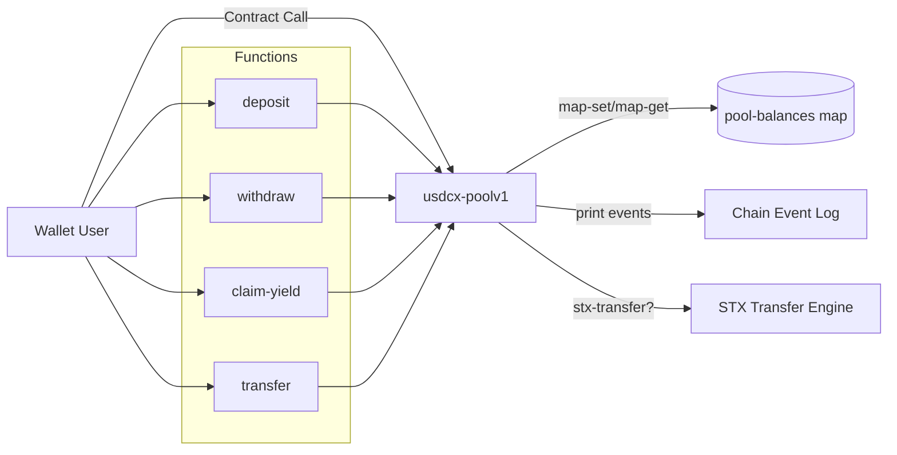

# USDCX Pool

[](https://www.stacks.co/)


Production-oriented Clarity contract for a simple pool ledger on Stacks, with mainnet publication and local development workflow through Clarinet.

## Table of Contents

- [Status](#status)
- [Overview](#overview)
- [Core Behavior](#core-behavior)
- [Architecture](#architecture)
- [Contract Interface](#contract-interface)
- [Repository Layout](#repository-layout)
- [Quick Start](#quick-start)
- [Deployment](#deployment)
- [Security and Scope Notes](#security-and-scope-notes)
- [Contributing](#contributing)
- [Pull Request Standards](#pull-request-standards)
- [Changelog](#changelog)
- [Roadmap](#roadmap)
- [License](#license)

## Status

- Mainnet Contract: SPGDS0Y17973EN5TCHNHGJJ9B31XWQ5YX8A36C9B.usdcx-poolv1
- Contract Name: usdcx-poolv1
- Language: Clarity
- Tooling: Clarinet, Vitest, clarinet-sdk

## Overview

USDCX Pool provides a lightweight on-chain accounting model where users can:

- track internal pool balances through deposits and withdrawals,
- claim a mock yield derived from their stored balance, and
- perform direct STX tip transfers.

This repository is optimized for clarity, auditability, and reproducible local workflows.

## Core Behavior

1. Internal balance ledger:
Pool balances are stored per user in contract state and updated by deposit and withdraw.

2. Yield simulation:
claim-yield returns a reward equal to current-balance / 10.

3. Native transfer path:
transfer uses stx-transfer? for direct STX movement between principals.

## Architecture



## Contract Interface

### Public Functions

| Function | Purpose | Returns |
| --- | --- | --- |
| deposit(amount uint) | Adds amount to sender internal pool balance | (ok true) |
| withdraw(amount uint) | Subtracts amount from sender internal pool balance | (ok true) |
| claim-yield() | Computes and returns mock reward (balance / 10) | (ok uint) |
| transfer(recipient principal, amount uint) | Sends STX from tx-sender to recipient | (ok true) |
| get-min-tip-amount() [read-only] | Returns configured minimum tip amount | (ok uint) |

### Error Codes

| Code | Constant | Meaning |
| --- | --- | --- |
| u100 | ERR-INVALID-AMOUNT | Amount is invalid or zero for operation |
| u101 | ERR-AMOUNT-TOO-LOW | transfer amount is below minimum |
| u102 | ERR-INSUFFICIENT-BALANCE | Requested withdrawal exceeds stored balance |

## Repository Layout

| Path | Description |
| --- | --- |
| contracts/usdcx-pool.clar | Main contract source |
| deployments/default.testnet-plan.yaml | Testnet deployment plan |
| deployments/default.mainnet-plan.yaml | Mainnet deployment plan |
| settings/Devnet.toml | Local devnet network configuration |
| settings/Testnet.toml | Testnet network configuration |
| settings/Mainnet.toml | Mainnet network configuration |
| tests/ | Test suite (currently no committed tests) |

## Quick Start

### Prerequisites

- Node.js 18 or newer
- npm
- Clarinet CLI

### Install

```bash
npm install
```

### Validate Contract

```bash
clarinet check
```

### Run Tests

```bash
npm test
```

### Coverage and Cost Report

```bash
npm run test:report
```

### Watch Mode

```bash
npm run test:watch
```

## Deployment

### Published Artifact

- SPGDS0Y17973EN5TCHNHGJJ9B31XWQ5YX8A36C9B.usdcx-poolv1

### Plans

- deployments/default.testnet-plan.yaml
- deployments/default.mainnet-plan.yaml

### Network Settings

- settings/Devnet.toml
- settings/Testnet.toml
- settings/Mainnet.toml

Sensitive deployment credentials are not committed in plain text for testnet/mainnet configurations.

## Security and Scope Notes

- deposit and withdraw are internal accounting operations, not token custody.
- transfer is the only path that executes native STX movement.
- claim-yield currently models reward logic and is not backed by external yield sources.

## Contributing

Contributions are welcome for tests, documentation, and contract hardening.

### Development Workflow

1. Create a feature branch from main.
2. Make focused, minimal changes.
3. Run local verification:

```bash
clarinet check
npm test
```

4. Update README and changelog when behavior changes.
5. Open a pull request using the standards below.

## Pull Request Standards

Every PR should include:

- a clear problem statement,
- a concise summary of changes,
- validation evidence (command outputs or screenshots where relevant),
- backward-compatibility notes,
- explicit mention of any security implications.

### Review Checklist

- Contract compiles cleanly with clarinet check.
- Behavior changes are covered by tests.
- Error paths and edge cases are addressed.
- Public interface changes are documented.
- No secrets or mnemonics are committed.

## Changelog

### 2026-03-30

- Mainnet publication recorded: SPGDS0Y17973EN5TCHNHGJJ9B31XWQ5YX8A36C9B.usdcx-poolv1
- README upgraded to a comprehensive professional format

## Roadmap

- Add full automated tests in tests/
- Introduce tokenized accounting path (for example SIP-010 based flows)
- Add governance and administrative controls for production economics

## License

This repository currently has no explicit license file. Add a LICENSE file before public reuse or external contributions.
